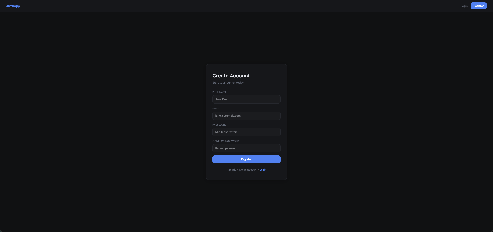
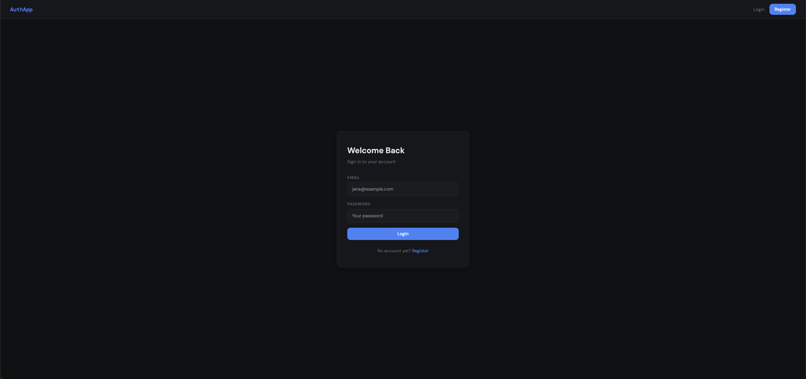
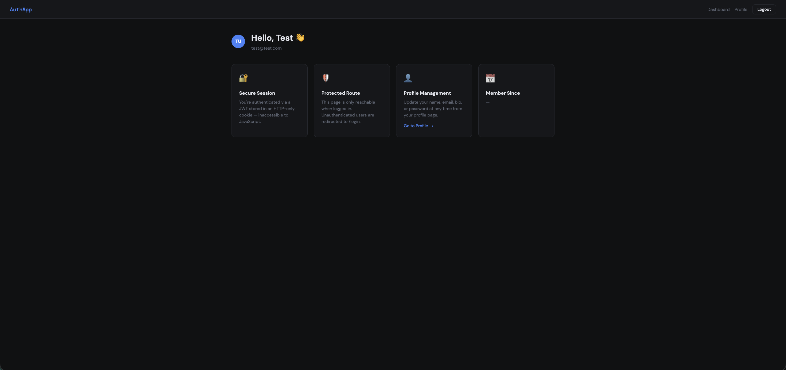
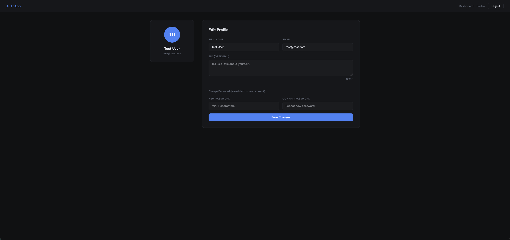

# MERN Auth App

A full-stack authentication app I built using MongoDB, Express, React and Node.js. Auth is handled with JWTs stored in HTTP-only cookies so they're never exposed to JavaScript.

## Screenshots

**Register**


**Login**


**Dashboard**


**Profile**


## What it does

- Register / login / logout
- JWT stored in an HTTP-only cookie (not accessible via JS)
- Protected routes — if you're not logged in you get redirected to /login
- Profile page where you can update your name, email, bio or password
- Global auth state managed with React Context

## Tech stack

- **Frontend** — React, React Router, Context API, react-toastify
- **Backend** — Node.js, Express, Mongoose
- **Database** — MongoDB
- **Auth** — JWT + HTTP-only cookies, bcryptjs for password hashing

## Project structure

```
mern-auth/
├── backend/
│   ├── config/         # MongoDB connection
│   ├── controllers/    # Route logic
│   ├── middleware/     # auth + error handlers
│   ├── models/         # Mongoose User model
│   ├── routes/         # Express routes
│   ├── utils/          # JWT cookie helper
│   └── server.js
├── frontend/
│   └── src/
│       ├── context/    # AuthContext
│       ├── hooks/      # useApi fetch wrapper
│       ├── components/ # Navbar, PrivateRoute
│       └── pages/      # Login, Register, Dashboard, Profile
└── package.json
```

## API routes

| Method | Route | Access | Description |
|--------|-------|--------|-------------|
| POST | /api/users/register | Public | Register |
| POST | /api/users/login | Public | Login + set cookie |
| POST | /api/users/logout | Public | Clear cookie |
| GET | /api/users/profile | Private | Get profile |
| PUT | /api/users/profile | Private | Update profile |

## Running it locally

You'll need Node.js and MongoDB installed.

```bash
# install everything
npm run install-all

# set up env
cd backend
cp .env.example .env
# fill in your MONGO_URI and JWT_SECRET
```

`.env` example:
```
NODE_ENV=development
PORT=5001
MONGO_URI=mongodb://localhost:27017/mernauth
JWT_SECRET=your_secret_here
```

```bash
# run both servers from root
npm run dev
```

Frontend runs on http://localhost:3000, backend on http://localhost:5001.

> Note: port 5000 is taken by macOS Control Center so I'm using 5001 for the backend.
